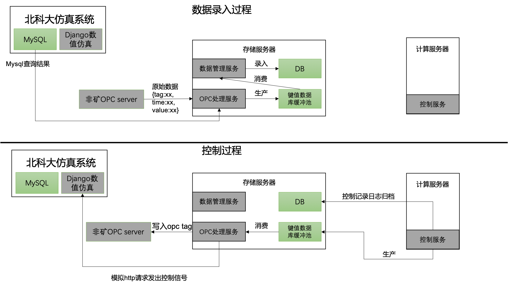

# OPC_仿真系统_服务器数据拓扑

2019年6月20日，下午在袁兆麟、李佳、周佳城三人内部讨论下，拟定非矿OPC server、充填仿真系统、计算服务器、存储服务器数据拓扑关系图。

### 拓扑结构图如下

- 计算服务器：具有较好的内存、CPU、GPU，用于整个系统运行智能控制算法、视频图像处理算法、数据矫正算法、Web服务等对计算量要求较高的服务模块。
- 存储服务器：具有大容量的企业级硬盘、较好的网卡（万兆光纤网卡）以及大内存，用于运行项目数据库及存储静态文件（深度学习网络模型、采场模型、视频图像）。
- OPC处理服务：由**python2**实现，运行在存储服务器中，负责从仿真系统或Opc server读出实时监测数据，作为键值数据库缓冲池中**监测数据的生产者**，将监测数据写入缓冲池。同时，也作为键值数据库中**控制信号量的消费者**，将控制量写入Opc server或仿真系统中。
- 数据管理服务：作为键值数据库缓冲池中**监测数据的消费者**，将监测数据归档录入到DB。
- 北科大仿真系统：也称充填仿真系统，其包括一个由django实现的**充填仿真计算模块**和**充填状态可视化模块**，仿真模块会定时地将生产数据写入MySQL中暂存
- 非矿OPC server：美卓公司提供的工控系统中自带的OPCServer，目前调研发现只支持OPC DA协议，如果使用python作为OPC客户端进行OPC server通信**只能使用python2**。

#### 数据录入过程

1. 开辟一个独立的**OPC处理服务**进程，从**北科大仿真系统**或**非矿现场OPC server**中读取最新的监测数据。
2. OPC处理服务进程将读到的数据源源不断地写入**键值数据库缓冲池的消息队列**中。
3. 数据管理服务也是一个在存储服务器中独立运行的服务进程，作为**键值数据库缓冲池的消息队列**消费者，不停地读消息队列，每读取一条数据就将其删除，整理成(ID，设备ID，时间，数值，其他)的形式写入DB。

#### 控制过程

1. 控制服务调用控制算法得出**控制量**后，将其写入存储服务器的**键值数据库缓冲池的消息队列（控制信号对应的表）**中。
2. OPC处理服务作为**键值数据库缓冲池的消息队列（控制信号对应的表）**的消费者，不停地读消息队列，每读取一条数据就将其作用到北科大仿真系统或非矿OPC Server
   - 作用到北科大仿真系统：使用python2中模拟发Http请求的工具发送(控制量、控制设备编号)到Django服务器。
   - 作用到非矿OPC server：利用OPC工具包中写tag的方法，基于OPC DA协议实现控制

