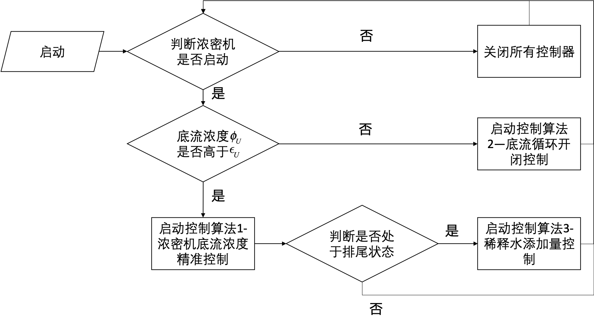
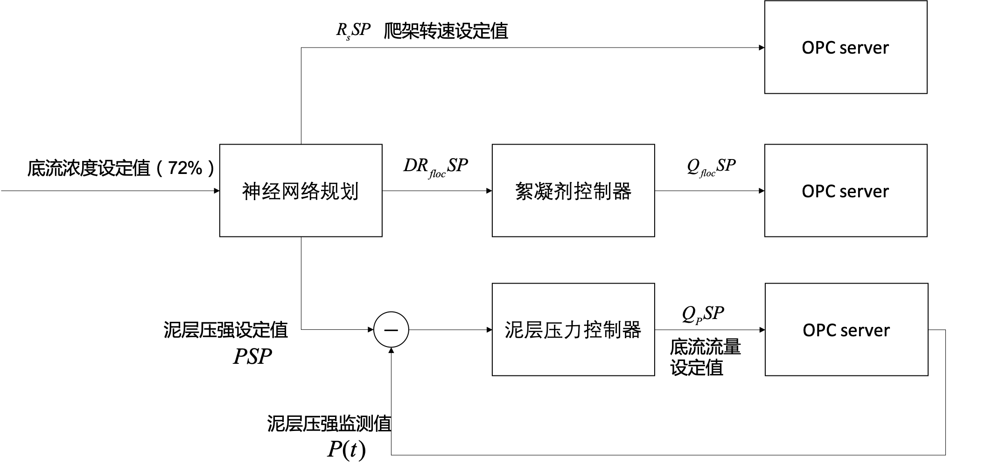
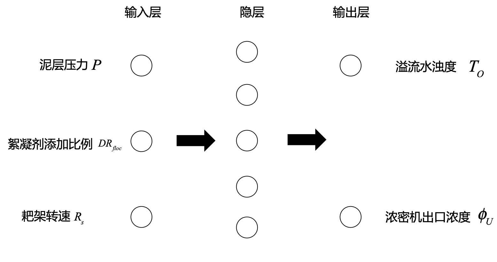

# 浓密机控制

浓密机控制模块主要通过对深锥浓密机、底流管道、稀释水管路上的传感器监测值进行分析，实现对浓密机耙架转速(rpm)、絮凝剂添加量($m^3/h$)设定值、底流流量设定值($m^3/h$)、稀释水流量设定值($m^3/h$)、底流循环阀门的调节。

> 注：本文只说明了其中一台浓密机和一台所属的底流泵控制算法，其他底流泵与浓密机控制算法相同。
>
> 另外现场的诸多设备是一用一备或者两用一备的，考虑到实际控制过程中涉及到备用设备的切换，此部分需要在详细调研OPC数据接口后进行设计。

## 变量定义

| 符号          | 含义                                | 获得方法                                        | 备注                           |
| ------------- | ----------------------------------- | ----------------------------------------------- | ------------------------------ |
| $\phi_P$      | 底流浓度(%)                         | 根据$C_P$间接计算                               | 有稀释水                       |
| $C_P$         | 底流密度计监测密度($kg/m^3$)        | 从opc获得数据                                   | 有稀释水                       |
| $Q_P$         | 底流流量计监测流量（$m^3/h$）       | 从opc获得数据                                   | 有稀释水                       |
| $\phi _F$     | 进料浓度(%)                         | 根据$C_F$间接计算                               |                                |
| $C_F$         | 进料密度计监测密度($kg/m^3$)        | 从opc获得数据                                   | 一般为15-35%，干重$360t/h$     |
| $Q_F$         | 进料流量计监测流量（$m^3/h$）       | 从opc获得数据                                   | 一般为$400-1200m^3/h$          |
| $\phi _U$     | 浓密机出料浓度(%)                   | 利用稀释水流量$F_1$、$F_2$换算                  |                                |
| $C_U$         | 浓密机出料密度($kg/m^3$)            | 利用稀释水流量$F_1$、$F_2$换算                  |                                |
| $Q_U$         | 浓密机出料流量($m^3/h$)             | 利用稀释水流量$F_1$、$F_2$换算                  |                                |
| $F_{1}$       | 浓密机底流大管道稀释水流量($m^3/h$) | 从opc获得数据                                   | 对应PID图中口径为DN100的管道   |
| $F_2$         | 浓密机底流小管道稀释水流量($m^3/h$) | 从opc获得数据                                   | 对应PID图中口径为DN40的管道    |
| $T_O$         | 溢流水浊度(turbidity over)，(ppm)   | 从opc获得数据                                   |                                |
| $R_s$         | 耙架转速(rpm)                       | 从opc获得数据                                   |                                |
| $Q_{Floc}$    | 絮凝剂添加流量($m^3/h$)             | 从opc获得数据                                   |                                |
| $P$           | 浓密机底部泥层压力($kPa$)           | 从opc获得数据                                   |                                |
| $L$           | 浓密机泥层高度($m$)                 | 从opc获得数据                                   |                                |
| $Torque$      | 耙架扭矩(%)                         | 从opc获得数据                                   | %85下为安全范围                |
| $DR_{floc}$   | 实际絮凝剂添加比例(dose rate),$g/t$ | 利用$Q_{Floc}$$、\phi _F$、$C_F$、$Q_F$计算获得 | 一般为20-25g/t                 |
| $F_VT$        | 通向排尾泵的阀门开闭状态            | 从opc获得数据                                   | 1为开，0为关，下同             |
| $F_VC$        | 通向水泥搅拌槽的阀门开闭状态        | 从opc获得数据                                   |                                |
| $F_VH$        | 高位循环阀门开闭状态                | 从opc获得数据                                   |                                |
| $F_VW1$       | 浓密机底流大管道稀释水阀门开闭状态  | 从opc获得数据                                   |                                |
| $F_VW2$       | 浓密机底流小管道稀释水阀门开闭状态  | 从opc获得数据                                   |                                |
|               |                                     |                                                 |                                |
|               |                                     |                                                 |                                |
| $R_sSP$       | 耙架转速设定值                      | 通过控制算法1计算得到                           | 是否可控待定                   |
| $DR_{floc}SP$ | 絮凝剂添加比例设定值                | 控制算法1输出量                                 | 在$20-25g/t$左右轻微浮动       |
| $Q_{Floc}SP$  | 絮凝剂添加量设定值                  | 控制算法1输出量                                 |                                |
| $Q_USP$       | 浓密机出料流量                      | 控制算法1输出量                                 |                                |
| $Q_PSP$       | 底流泵流量设定值                    | 控制算法1输出量                                 | 浓密机出料流量+稀释水流量      |
| $PSP$         | 浓密机底部泥层压力设定值            | 控制算法1输出量                                 |                                |
| $F_1SP$       | 浓密机底流大管道稀释水流量设定值    | 控制算法3输出量                                 |                                |
| $F_2SP$       | 浓密机底流小管道稀释水流量设定值    | 控制算法3输出量                                 |                                |
| $F_VH$        | 高位循环阀门开闭状态设定            | 控制算法2输出量                                 |                                |
| $F_VW1$       | 浓密机底流稀释水大管道阀门开闭状态  | 控制算法3输出量                                 |                                |
| $F_VW2$       | 浓密机底流稀释水小管道阀门开闭状态  | 控制算法3输出量                                 |                                |
|               |                                     |                                                 |                                |
| $\phi_U^*$    | 理想浓密机出料浓度                  | 控制算法1输入量                                 | 目标值暂时$72\%$，以后可能变动 |
| $T_O^*$       | 溢流水浊度警戒线                    | 控制算法1输入量                                 | 默认为200ppm                   |
| $C_U^*$       | 理想底流密度                        | 控制算法1输入量                                 | 根据$\phi_U^*$计算             |
| $\phi_{UT}^*$ | 理想排尾浓度                        | 控制算法3输入量                                 | 默认为55%                      |
|               |                                     |                                                 |                                |
|               |                                     |                                                 |                                |

### 数据预处理

由于现场工况不稳定，会导致传感器监测数据存在波动，如果单用某一时刻的仪表值来评估系统状态并计算控制策略，监测的误差很可能影响到控制策略的性能，因此需要对监测值进行平滑处理，削减仪表监测误差。

我们采用将最近时刻几个点进行加权求和的方式来对数据进行平滑预处理。

如以进料流量为例，即矫正后的$Q_F(t)$为：
$$
Q_F(t)=\frac{1}{L}\sum_{i=0}^{L-1}Q_F(t-i)
$$

其中$L$设定为5左右。

>  注：(L值设定有待考量)，是否不以个数，而以时间来选择区间效果更好？

### 浓度与密度的映射关系计算

- 浓度、密度关系表：

| 密度($g/cm^3$) | 1.10 | 1.15 | 1.20 | 1.25 | 1.30 | 1.35 | 1.40 | 1.45 |      |      |      |      |      |
| -------------- | ---- | ---- | ---- | ---- | ---- | ---- | ---- | ---- | ---- | ---- | ---- | ---- | ---- |
| **浓度**(%)    | 14.1 | 20.3 | 25.9 | 31.1 | 35.9 | 40.3 | 44.4 | 48.3 |      |      |      |      |      |

| 密度($g/cm^3$) | 1.50 | 1.55 | 1.60 | 1.65 | 1.70 | 1.75 | 1.80 | 1.85 | 1.90 |      |      |      |      |
| -------------- | ---- | ---- | ---- | ---- | ---- | ---- | ---- | ---- | ---- | ---- | ---- | ---- | ---- |
| **浓度**(%)    | 51.9 | 55.2 | 58.3 | 61.3 | 64.1 | 66.7 | 69.1 | 71.5 | 73.7 |      |      |      |      |

定义如下两个函数：

- $fdc(\cdot)​$：密度转浓度
  $$
  fdc(x)=fdc(\lfloor{x}\rfloor)+[fdc(\lceil{x}\rceil)-fdc(\lfloor{x}\rfloor)]*\dfrac{x-\lfloor{x}\rfloor}{\lceil{x}\rceil-\lfloor{x}\rfloor}
  $$

- $fcd(\cdot)$浓度转密度

  与$fdc(\cdot)​$类似，均假设相邻刻度内，密度变化为线型的。

###浓密机出口料浆信息计算

由于底流管道处的流量计、浓度计安装在稀释水添加节点后，因此需要根据稀释水添加量换算出浓密机排出的料浆信息，$\phi_U$、$Q_U$、$C_U​$ 代表浓密机出口处的浓度、流量、密度，其计算公式如下：
$$
C _U=\dfrac{C_P*Q_P-(F_1+F_2)\rho_w}{Q_P-F_1-F_2}
$$

$$
Q_U=Q_P-F_1-F_2
$$

$$
\phi_U=fdc(C_U)
$$

## 控制模型

### 控制模型的启动

该控制模块分三个子控制模型，分别是**浓密机底流浓度精准控制、底流循环开闭控制、稀释水添加量控制**，三个模型的启动逻辑如图所示：

流程图中，$\epsilon_U$参考值为50%。

## 控制算法1——浓密机底流浓度精准控制

底流浓度精准控制共分为三个子控制器：

- 神经网络规划器：利用短期历史数据监测数据进行预测模型训练，根据浊度警戒线(200ppm)、底流浓度理想值(72%)情况下，规划出最优的絮凝剂添加比例$DR_{floc}SP$、最优泥层压力设定值$PSP$、最优耙架转速设定值$R_sSP$
- 絮凝剂控制器：根据实时的进料流量、浓度，以及神经网络规划器给出的絮凝剂添加比例，动态调节絮凝剂添加流量$Q_{floc}SP$，并发送给opc server
- 泥层压力控制器：利用闭环反馈P控制算法与泥层动态平衡原理相结合，动态调整底流流量设定值，促使泥层压力瞬时监测值$P(t)$追踪由神经网络规划器给出的压强设定值$PSP$

### 神经网络规划器

神经网络结构如下：

神经网络为(3-5-2)结构，用于预测泥层压力、絮凝剂添加比例、耙架转速对于底流浓度和溢流水浊度的影响。对于浓密机运行在充填状态和排尾状态需要分别构建两个模型。

- 网络的训练

  挑选浓密机历史运行数据进行网络训练，建议超过1000条，所选数据需要满足如下要求：

  - 浓密机出料浓度不能偏离此时生产模式对应的理想浓度过多，如充填时浓度控制在$65\%-74\%$情况下的数据才有效，排尾时浓度控制在$45\%-60\%$情况下的数据才有效，
  - 被选择的数据应满足溢流水浊度小于250ppm
  - 不能选择运行底流循环期间的数据
  - 每五分钟之内，最多选择一条数据

  损失函数选择交叉熵损失和MSE损失均可。

- 利用神经网络反向传播方法求解最优规划量

  定义$u(t)=[PSP,DR_{floc}SP,R_sSP]^T$

  定义惩罚函数为
  $$
  L(u)=\alpha_1 max(T_O-T_O^*,0)+\alpha_2(\phi_U-\phi_U^*)^2
  $$

  $\alpha _1​$和$\alpha_2​$用于平衡**溢流水浊度超标量**和**底流浓度误差量**对惩罚值的权重。

  规划量$u(k)​$的求解为：
$$
u(k)=\arg \min_{u}L(u)
$$
  具体求解方法可以采用随机初始化$u_0(k)​$，然后基于梯度下降进行迭代计算，也可以采用遗传算法计算

> 注：网络的输入值和输出值必须归一化。

### 絮凝剂控制器

絮凝剂控制器的功能是根据实时的进料流量、浓度，以及神经网络规划器给出的絮凝剂添加比例，动态调节絮凝剂添加流量。

一般生产过程中给出的絮凝剂用量比例为在$5g/t​$，即对于包含1t干重的尾矿浆，需要添加5g絮凝剂干粉，神经网络规划器给出的用量比例会与$5g/t​$接近，根据絮凝剂的稀释比率，我们可以推算出絮凝剂流量的给定值
$$
Q_{F l o c} S P=\frac{Q_{F}(t) * \phi_{F}(t) * C_{F}(t) * D R_{F l o c} S P(t)}{F C * 1000}
$$
$FC​$ 是絮凝剂稀释浓度 $(g/l)​$

> 注：絮凝剂稀释浓度FC现在不确定是否是恒定的

### 泥层压力控制器

浓密机内泥砂干重瞬时量$m(t)$可以表示为：
$$
m(t)=\frac{P(t)S}{g}\phi_{bed}
$$

$\phi _{bed}​$为泥床平均浓度(%)，介于底流浓度和进料浓度之间，$S=(\frac{d}{2})^2\pi​$为浓密机底面积，此处假设浓密机为圆柱形状，东南矿体深锥浓密机直径$d​$约为$18m​$。上式可表示为
$$
m(t)=\frac{P(t)d^2\pi}{4g}[\beta\phi_U+(1-\beta)\phi_F]
$$
$\beta \in (0.7,0.95)​$

同时浓密机中干砂质量的变化速率还满足如下固体守恒定律：
$$
\dfrac{dm(t)}{dt}=Q_F(t)C_F(t)\phi_F(t)-Q_U(t)C_U(t)\phi_U(t)
$$
即浓密机内剩余固体质量的变化等于由于进料导致的固体增加量和底流导致的固体减少量的差。

将式(10)带入式(11)，浓密机出口流量满足如下等式：
$$
Q_U(t)=\dfrac{Q_F(t)C_F(t)\phi_F(t)}{C_U(t)\phi_U(t)}-\dfrac{d^2\pi[\beta\phi_U+(1-\beta)\phi_F]}{4g}\cdot\frac{dP}{dt}
$$
泥层压力控制器的作用是通过调节底流流量设定值，使浓密机底部泥层压力值$P(t)$追踪由神经网络规划器给出的泥层压力目标值$PSP$，因此将式(12)中$dP$替换为当前压强与目标压强的差值,$dt$替换为追踪时间，即可得到
$$
Q_USP=\dfrac{Q_F(t)C_F(t)\phi_F(t)}{C_U(t)\phi_U(t)}-\gamma\dfrac{d^2\pi[\beta\phi_U+(1-\beta)\phi_F]}{4g}\cdot\frac{PSP-P(t)}{\Delta t}
$$

上式中的$\gamma$是一个控制参数，取值越大，控制追踪的速度越快。

>  注：该控制方程等价于在固体质量平衡基础上，附加一个比例控制器来对浓密机出料流量进行调节，促使泥层压强追踪其设定值，当泥层压强与压强目标值相同时，$Q_USP$恰好满足使浓密机内固体质量不变的流量设定值

由此可以得到底流流量的设定值：
$$
Q_PSP=Q_USP+F_1+F_2
$$

> 当未开启稀释水泵时，$Q_USP=Q_PSP​$，

另外由于搅拌机的承载能力有限，底流流量不得超过180$m^3/h$

即
$$
Q_PSP=min(180,Q_USP)
$$

## 控制算法2——底流循环开闭控制

底流循环开闭控制逻辑如下图：

$\epsilon_T$参考值为180ppm

- 打开底流循环顺序：
  1. 打开$F_VH$
  2. 关闭$F_VC$或$F_VT$
- 关闭底流循环顺序:
  1. 打开$F_VC$或$F_VT$
  2. 关闭$F_VH$

> 注：顺序出现错误可能导致管道损坏，且开启底流循环时底流稀释水阀门、稀释水泵电机需关闭。

## 控制算法3——稀释水添加量控制

稀释水流量控制在当前浓密机工作在充填情况下，只开小管稀释。

在排尾时，同时打开大管和小管稀释。

稀释水量需满足浓密机底流经过稀释后，底流浓度为$\phi_{UT}^*​$，即满足如下等式：
$$
\phi_{UT}^*=\dfrac{Q_PC_P\phi_P}{Q_UC_U+(F_1SP+F_2SP)\rho _w}
$$

按照管道口径来分配各自的流量大小，即排尾时：
$$
F_1SP=\frac{5}{7}\times\dfrac{Q_PC_P\phi_P-Q_UC_U\phi_{UT}^*}{\phi_{UT}^*\rho_w}
$$

$$
F_2SP=\frac{2}{7}\times\dfrac{Q_PC_P\phi_P-Q_UC_U\phi_{UT}^*}{\phi_{UT}^*\rho_w}
$$

同时需确保稀释水阀门$F_VW1$、$F_VW2$处于打开状态

充填时
$$
F_2SP=\dfrac{Q_PC_P\phi_P-Q_UC_U\phi_{UT}^*}{\phi_{UT}^*\rho_w}
$$

同时需确保稀释水阀门$F_VW2$处于打开状态

> 注：稀释水泵总共有三套，其中有一套是备用水泵，可以根据当前阀门状态判断目前开启的是哪个稀释水泵，如果阀门没有开，不做稀释水控制处理。

## 应急控制策略

### 耙架扭矩监测

当耙架扭矩$Torque>60\%$时，关闭所有控制器，不再进行opc写操作。

其他应急控制策略后续待补