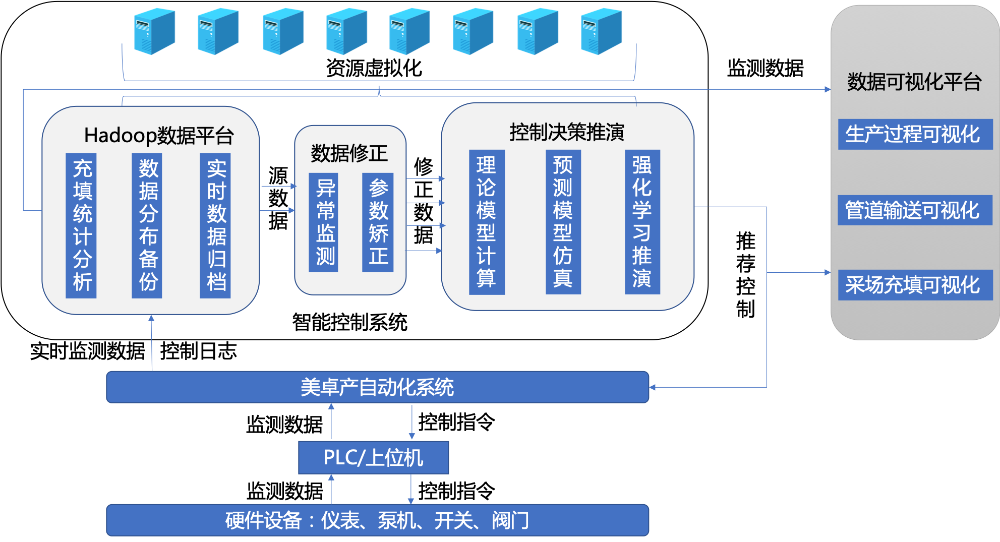

# 系统总体架构

## 层次架构

系统通过opc服务实现与美卓系统的通信，从美卓系统中获得数据首先存储至Hadoop数据平台，在平台内部经过数据矫正算法，分布式地存储在多个虚拟节点中。

## 软件组织结构

软件组织结构如下图：

- 数据库采用mongoDB，大型文件存储利用HDFS。
- web平台使用django框架开发。
- 三维可视化部分采用基于WebGL、three.js技术的前端组建。
- 智能控制器中的每个子控制器作为独立线程运行。

- 项目整体部署打包采用docker-compose。